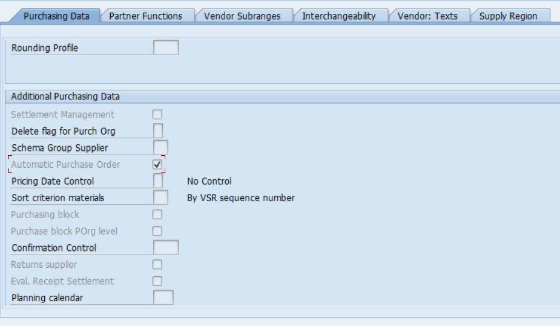
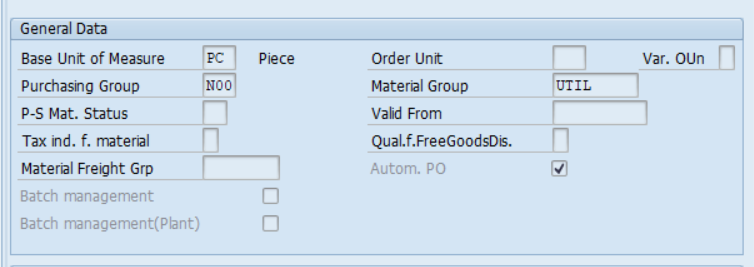
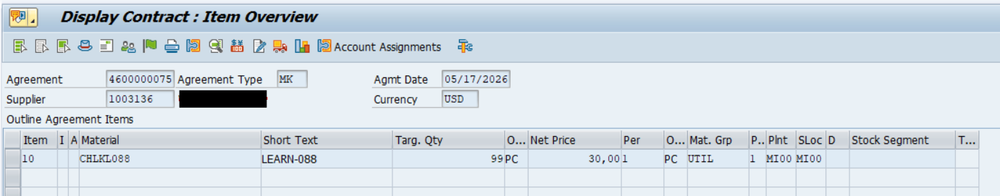
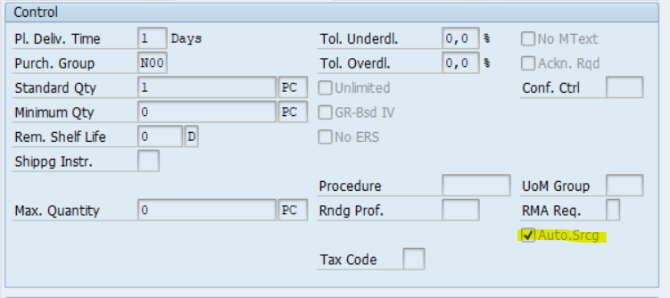
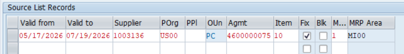

# Automatic Purchase Order from Purchase Requisition (PR → PO)

## Business Purpose

This process describes the automatic creation of Purchase Orders (PO) from Purchase Requisitions (PR) in SAP using predefined source determination logic. The process is executed through transaction **ME59N** or via background job execution.

---

# Prerequisites (Master Data & System Configuration)

For the automatic PO creation process to work correctly, the following conditions must be fulfilled.

## 1. Vendor Master / Supplier

The **Automatic Purchase Order** indicator must be activated in the vendor purchasing data.

### Example



---

## 2. Material Master

The **Automatic PO** indicator must be activated in the Purchasing view of the material master.

### Example



---

## 3. Source of Supply

A valid source of supply must be assigned to the Purchase Requisition item.

Possible valid sources:
- Outline Agreement
- Purchasing Info Record
- Fixed Vendor via Source List

---

## 3.1 Outline Agreement

A valid procurement agreement must exist:
- Contract
- Scheduling Agreement

The agreement must be valid for:
- Purchasing Organization
- Vendor
- Material

### Example



---

## 3.2 Purchasing Info Record

A valid Purchasing Info Record must exist for the material and vendor combination.

Automatic source determination should be enabled where required by configuration.

### Example



---

## 3.3 Source List (ME01)

Transaction: **ME01**

Required settings:
- Valid vendor assigned
- Source marked as **Fixed**
- MRP-relevant indicator maintained correctly

### Example



---

# Process Flow

PR Creation  
→ Source Determination  
→ Contract / Info Record / Source List Validation  
→ ME59N Execution  
→ Automatic PO Creation

---

# Execution (Transaction ME59N)

## Step 1 – Run Transaction

Execute transaction:

```sap
ME59N