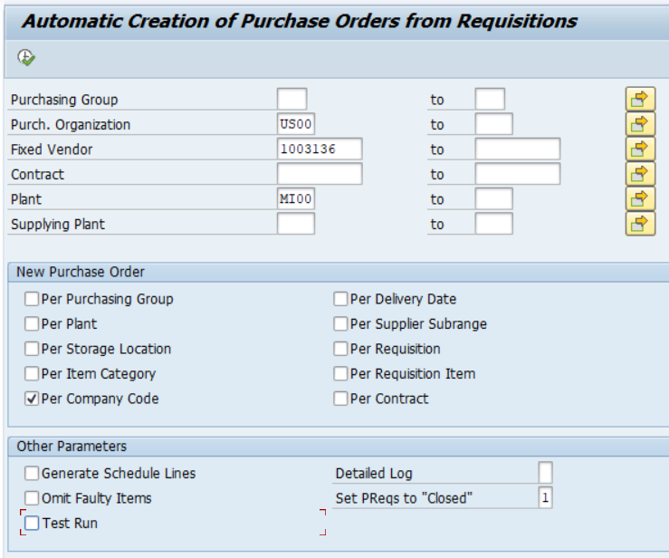
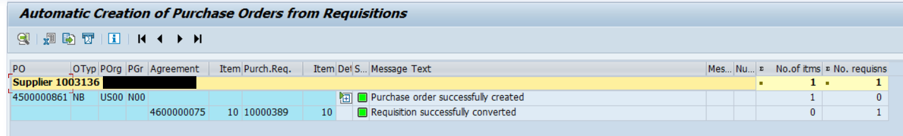

````md
# Automatic Purchase Order from Purchase Requisition (PR → PO)

## Business Purpose

This process describes the automatic creation of Purchase Orders (PO) from Purchase Requisitions (PR) in SAP using predefined source determination logic. The process is executed through transaction **ME59N** or via background job execution.

---

# Prerequisites (Master Data & System Configuration)

For the automatic PO creation process to work correctly, the following conditions must be fulfilled.

## 1. Vendor Master / Supplier

The **Automatic Purchase Order** indicator must be activated in the vendor purchasing data.

### Example


---

## 2. Material Master

The **Automatic PO** indicator must be activated in the Purchasing view of the material master.

### Example


---

## 3. Source of Supply

A valid source of supply must be assigned to the Purchase Requisition item.

Possible valid sources:
- Outline Agreement
- Purchasing Info Record
- Fixed Vendor via Source List

---

### 3.1 Outline Agreement

A valid procurement agreement must exist:
- Contract
- Scheduling Agreement

The agreement must be valid for:
- Purchasing Organization
- Vendor
- Material 

### Example


---

### 3.2 Purchasing Info Record

A valid Purchasing Info Record must exist for the material and vendor combination.

Automatic source determination should be enabled where required by configuration.

### Example


---

### 3.3 Source List (ME01)

Transaction: **ME01**

The following settings are required:
- Valid vendor assigned
- Source marked as **Fixed**
- MRP-relevant indicator maintained correctly

### Example


---

# Process Flow

PR Creation  
→ Source Determination  
→ Contract / Info Record / Source List Validation  
→ ME59N Execution  
→ Automatic PO Creation

---

# Execution (Transaction ME59N)

## Step 1 – Run Transaction

Execute transaction:

```sap
ME59N
````

### Example



---

## Step 2 – Enter Selection Parameters

Enter required organizational data:

* Purchasing Organization
* Plant
* Purchasing Group (optional)

---

## Step 3 – Execute Simulation

Run simulation first to validate:

* Source determination
* Vendor assignment
* Master data consistency

### Example



---

# Output

Result of the process:

* Purchase Orders generated automatically
* Vendor assigned automatically
* Procurement process standardized through source determination logic

---

# Common Issues & Troubleshooting

## No Valid Source of Supply

Possible causes:

* Missing Source List entry
* Missing Info Record
* Invalid Contract / Scheduling Agreement
* Source determination not enabled during PR creation

---

## PR Not Converted to PO

Possible causes:

* PR not fully released
* Missing vendor assignment
* Automatic PO indicators not maintained
* Missing source determination

---

## ME59N Does Not Generate PO

Possible causes:

* Simulation errors ignored
* Incorrect selection parameters
* Inconsistent master data
* Invalid purchasing organization or plant assignment

---

# Notes (Important SAP Logic)

* SAP prioritizes a **Fixed Source of Supply** if multiple valid sources exist.
* ME59N does not determine the source itself; it only converts PRs that already contain valid source assignment data.
* Source determination behavior may depend on:

  * Source List configuration
  * Quota Arrangement
  * MRP settings
  * Purchasing customization

```
```
