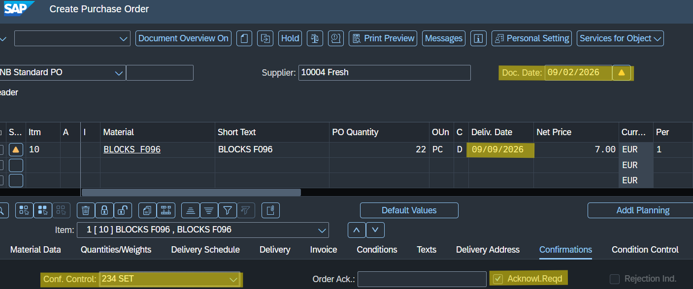
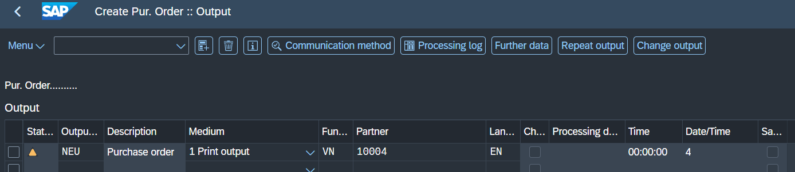
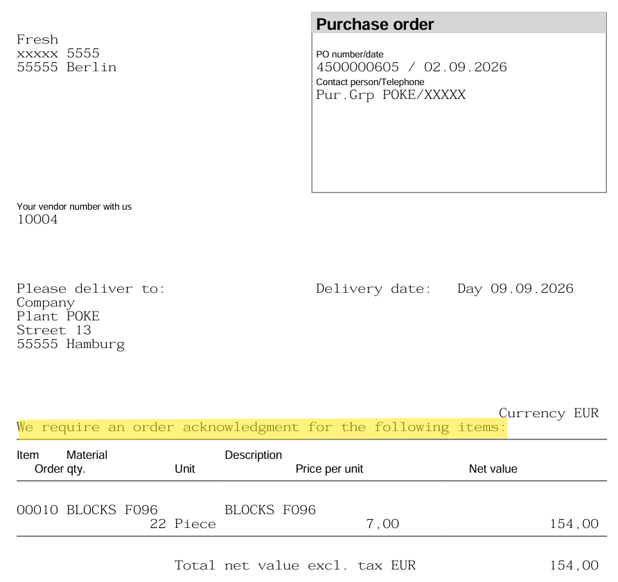
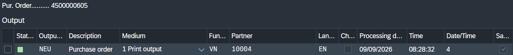
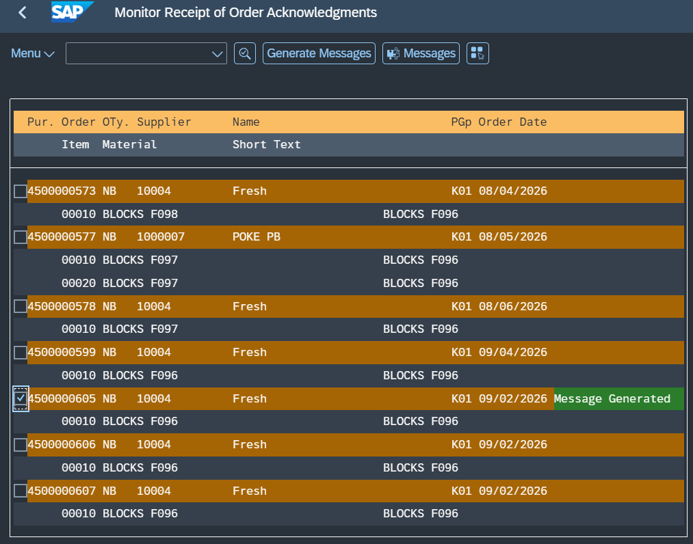
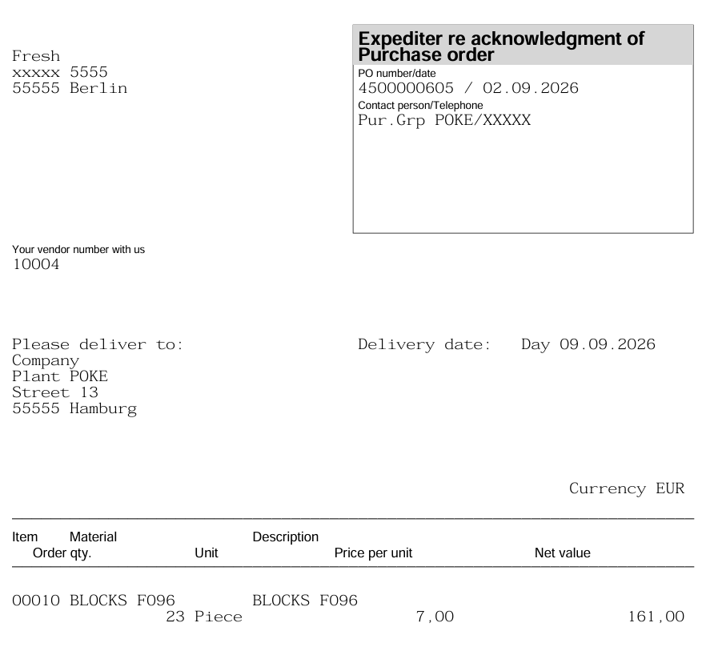
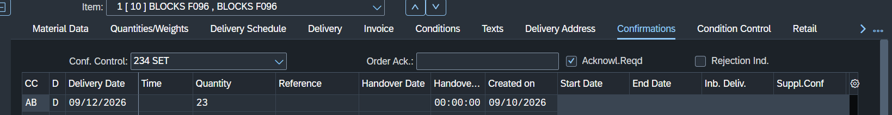
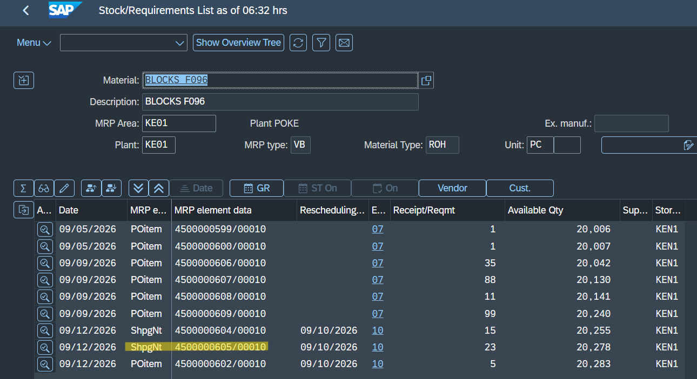
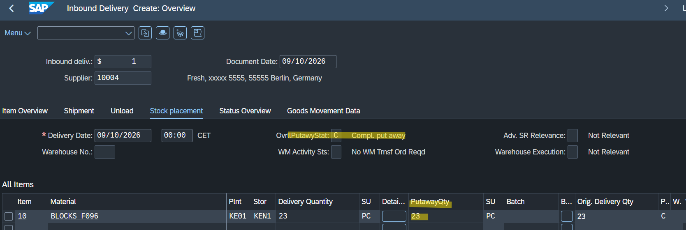

1. Based on our configuration, we want to create an order with a late confirmation from the vendor. To trigger this, we need to change the document date to be at least 3 days in the past. We create the order with our previously configured confirmation control key. (MORE ABOUT CUSTOMIZING CAPABILITIES HERE: [Confirmations Setup](../../confirmations/confirmations-setup)). 

Confirmation Control Key:

PO:

2. To enable confirmation reminders via transaction ME92F, we need to generate a message to the vendor asking for confirmation. To enable this, we must first check the "Acknowl. Reqd" (Acknowledgment Required) box in the PO. To see how to correctly set this up, go to: [Output Setup](../../confirmations/output-setup).

A PDF should be generated after saving:

The ME92F transaction will only work if the NEU output has been successfully completed:

3. In ME92F, you can send reminders if the delivery/confirmation is late. In our case, the confirmation is late, so we use ME92F. To avoid creating output parameters manually every time, we can create an automatic expected output condition using MN04/MN05 ([Auto Output Setup](../../confirmations/auto-output-setup)).

4. Input the parameters for which the document should be generated.

5. Select the orders for which the output should be generated and click "Generate Messages".

After saving, the output PDF should be generated automatically.

6. After we receive the confirmation from the vendor, we return to the PO and enter the "AB" (Order Acknowledgment) confirmation.

In MD04, we can see the status in the MRP element has been changed to "ShipNot". This is directly connected with our custom configuration of the AB confirmation being MRP-relevant. If this customization wasn't here, the status would remain the same and nothing would happen.

7. Instead of typing the next receiving step manually, we will let the system generate it, simulating real warehouse integration. Go to VL31N to create the Inbound Delivery, simulate stock placement, and fill in the "Putaway Qty". 

Because we have configured the control key to "Register and Receive Automatically", the Goods Receipt (101) is posted automatically in the background once the delivery is completed. The order will then disappear from MD04 because it has been completely picked up and received. As seen in the Purchase Order History, the 101 movement is now successfully generated.
