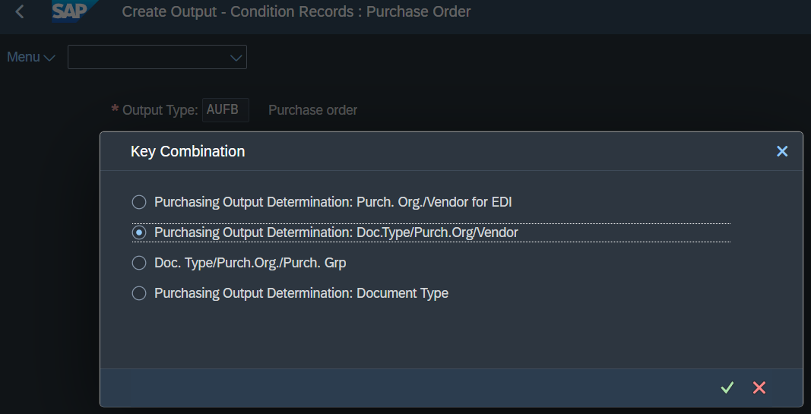
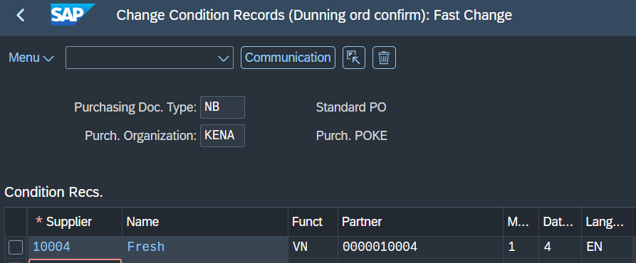
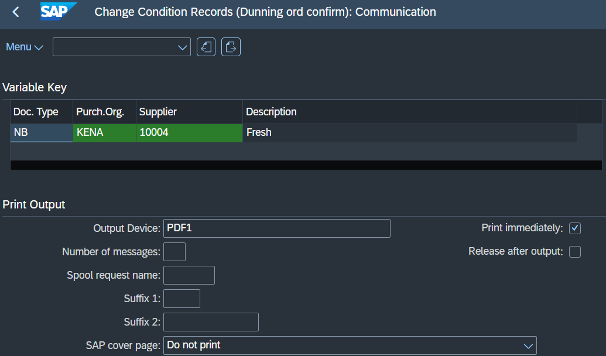

# SAP MM - Automated Output Determination for Vendor Reminders

This repository demonstrates how to set up automatic message outputs based on document types and expected prints. In this scenario, we configure the system to automatically generate the `AUFB` output for the `ME92F` transaction to handle late order confirmations from vendors.

## 1. Condition Records for Auto-Output (MN04)

To automate the output, you must define the condition records for the specific output type. Go to transaction `MN04`, input the `AUFB` output type, and set the expected area of automation (e.g., specific Purchasing Organization and Vendor).

## 2. Immediate Print Configuration

To ensure the PDF is generated instantly upon saving the document, configure the communication method within the condition record. Set the dispatch time to send immediately (option 4) and assign the output device.

---

## 3. Maintenance of Output Settings (MN05)

If you need to change the output settings or update the expected print behavior for an existing rule, you can modify the condition records using transaction `MN05`.