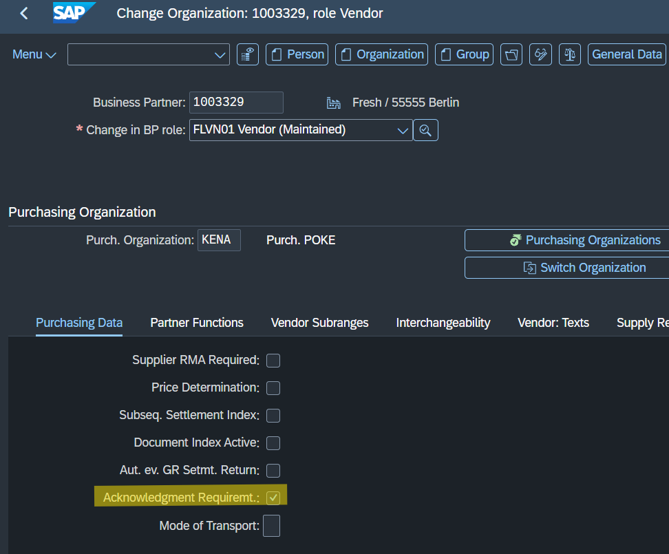
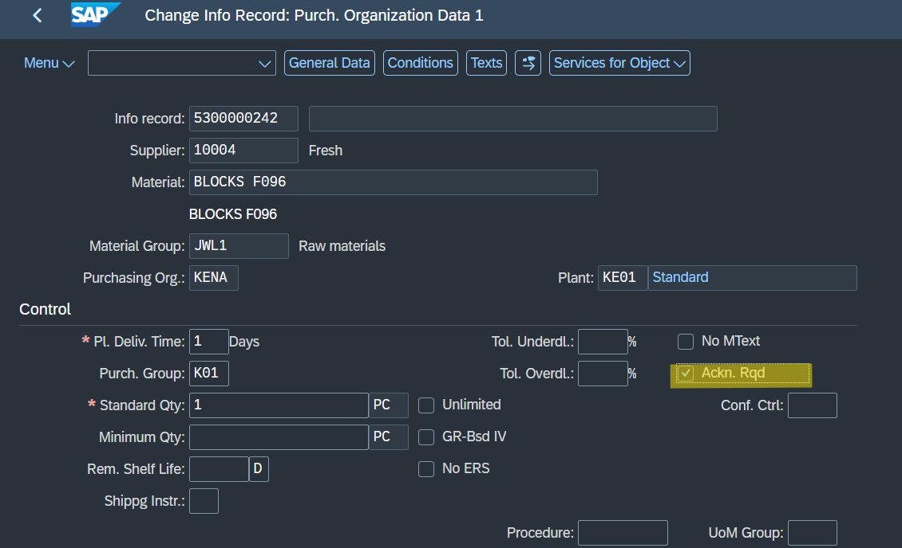
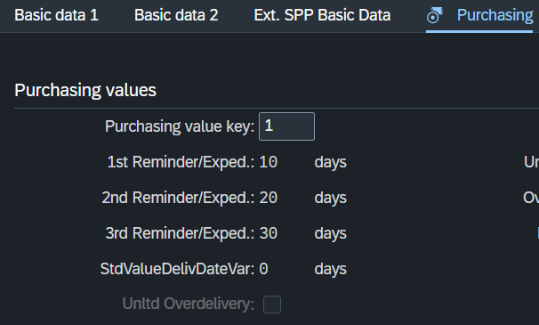
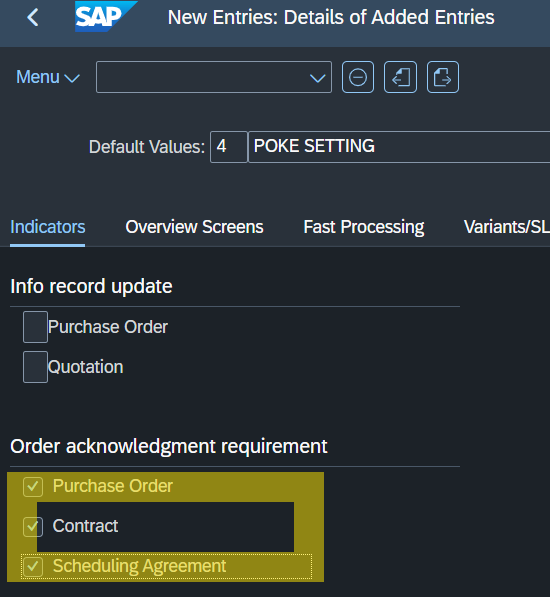
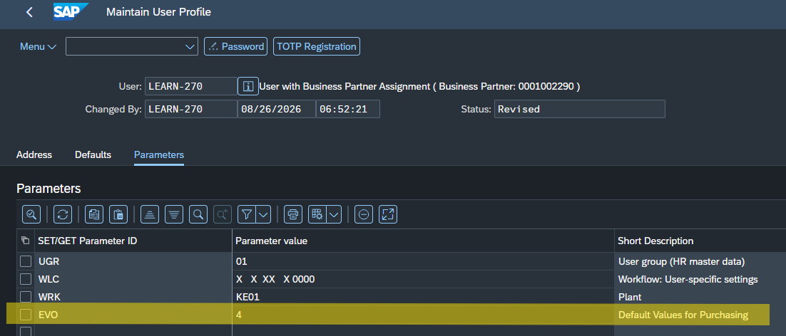
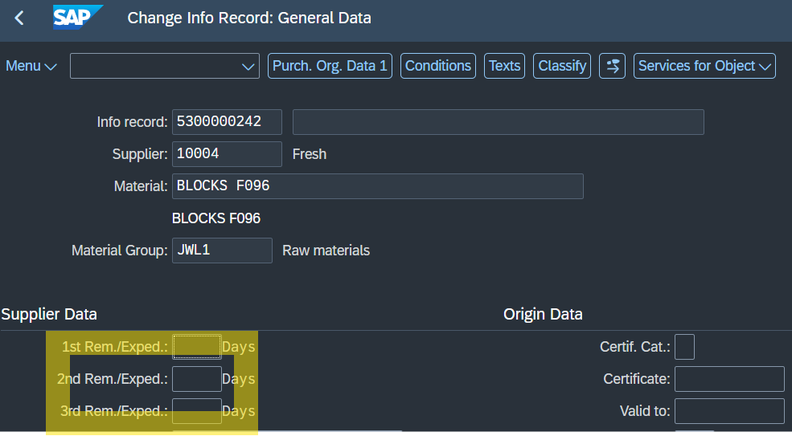
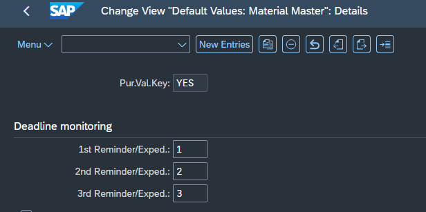
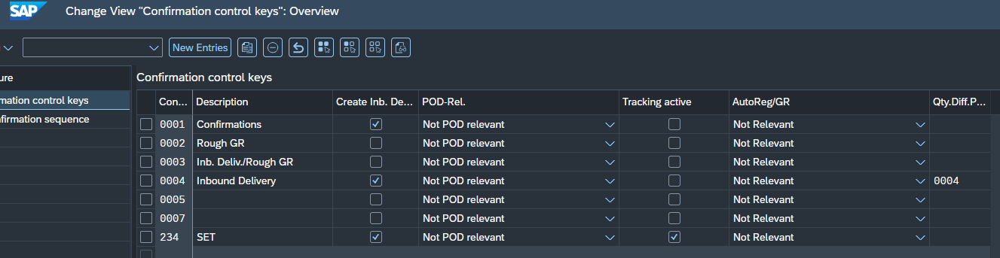

# SAP MM - Purchase Order Confirmations & Reminders

This repository provides a comprehensive guide on configuring and managing Purchase Order (PO) Confirmations and Reminders in SAP S/4HANA. It covers the master data hierarchy for setting up acknowledgment requirements and the backend customization needed to automate the reminder process.

## 1. Pre-settings: Order Acknowledgment Required

To automate the `Acknowl. Reqd` indicator in purchasing documents, SAP utilizes a specific master data hierarchy. You can set this requirement at multiple levels:

### 1.1 Business Partner (BP)
You can set up the confirmation requirement directly in the vendor's master data. Go to the **Purchasing** view of the Supplier role in transaction `BP` to check the acknowledgment required box.

### 1.2 Purchasing Info Record (ME11)
The Info Record combines the Vendor, Material, and Purchasing Organization. Setting the acknowledgment requirement here overrides the general material and vendor settings. 

### 1.3 Material Master (MM02)
In the **Purchasing** tab of the material master, you can assign a Purchasing Value Key (PVK) to automate expected reminder days and confirmation requirements for specific materials.

### 1.4 Default Values for Purchasing (OMFI & SU3)
To set up default behaviors per user (e.g., defaulting the requirement for POs and Scheduling Agreements), configure the values in transaction `OMFI`. Then, assign the `EVO` parameter with the corresponding key to the user's profile in transaction `SU3`.

---

## 2. Reminders Configuration

SAP distinguishes between reminders for the actual physical delivery and reminders for the order acknowledgment (paperwork). 

### 2.1 Delivery Reminders
Delivery reminders prompt the vendor about the physical arrival of goods. 
* They can be configured in the general view of the Purchasing Info Record (`ME11`).

* They can also be automated using the Purchasing Value Key configured in `OME1` and assigned in `MM02`.

### 2.2 Order Acknowledgment Reminders
These reminders check if the vendor has sent the confirmation document. Their behavior is strictly tied to the Confirmation Control Key.
* **Configuration Path (SPRO):** *Materials Management ➔ Purchasing ➔ Confirmations ➔ Set Up Confirmation Control*
* In this configuration, you define the monitoring periods, reference dates, and the crucial `Subject to Reminder` indicator for specific confirmation sequences.

### 3. Automatic Goods Receipt (AutoReg/GR) in confirmation control key Configuration

Based on the Confirmation Control Key customizing at the header level, the `AutoReg/GR` parameter defines the exact level of automation for the Inbound Delivery (`VL31N`). 

Depending on the business requirement, the system behaves in one of four ways:

*   **0 (Not relevant):** Fully manual. After saving `VL31N`, the status stays the same. The Inbound Delivery number is added as an expected receipt in `MD04`, but the 101 Goods Receipt must be posted manually.
*   **1 (Register automatically):** System updates status. After `VL31N`, the MRP status in `MD04` is automatically changed to "Putaway," but the 101 movement is not posted yet.
*   **2 (Register and receive automatically):** Full automation (Touchless). Saving `VL31N` instantly posts the 101 Goods Receipt in the background. The order is no longer visible in `MD04` because the expected supply has immediately become physical unrestricted stock.
*   **3 (Automatically receive with manual registration):** Hybrid automation. After `VL31N`, the status in `MD04` does not change. The 101 movement is only posted in the background when the delivery is physically registered (e.g., a truck scanned at the gate triggering the "In Plant" status in `VL32N`). 
    *   *Note: Without active Yard Management or scanner integration, Option 3 safely degrades and behaves identically to Option 0.*