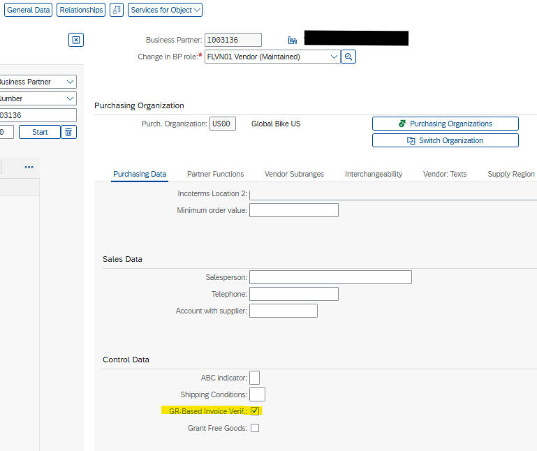
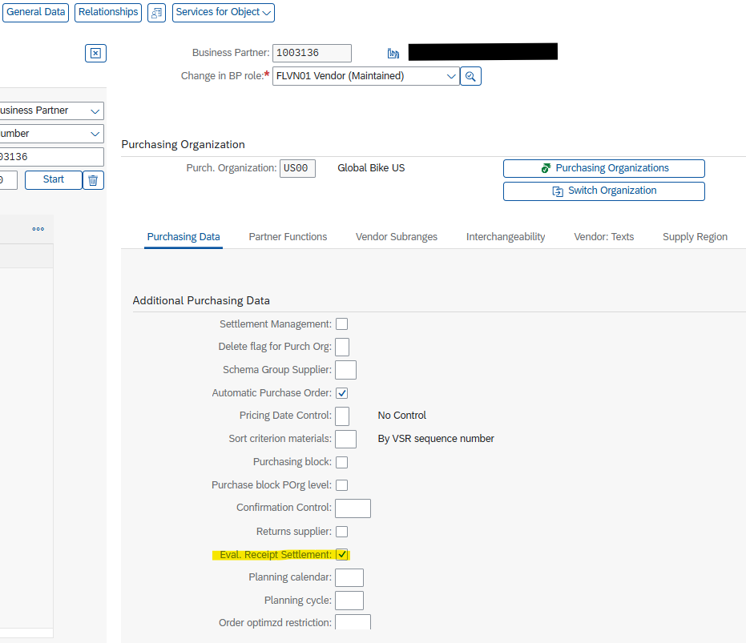
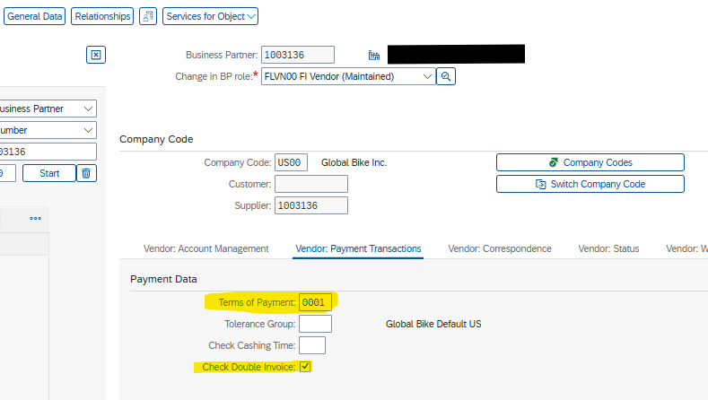
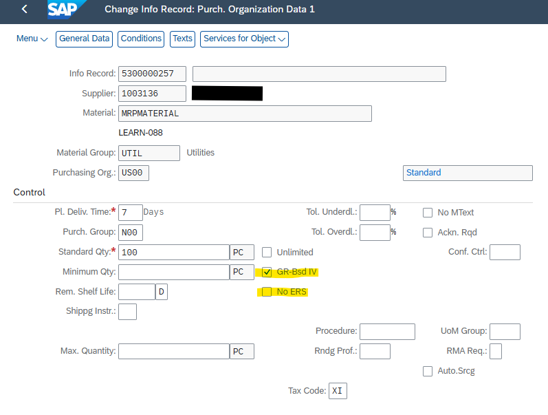
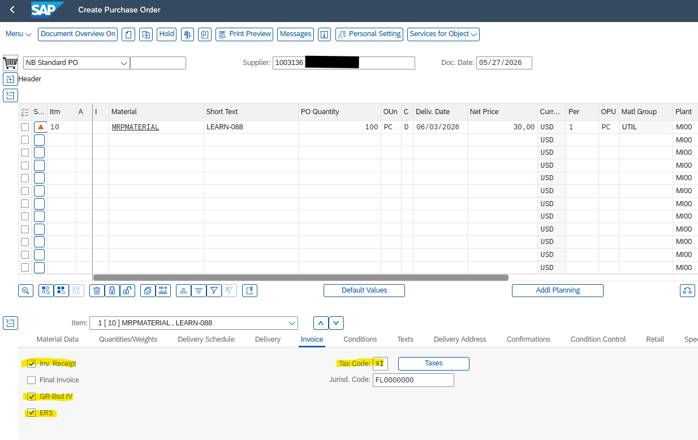
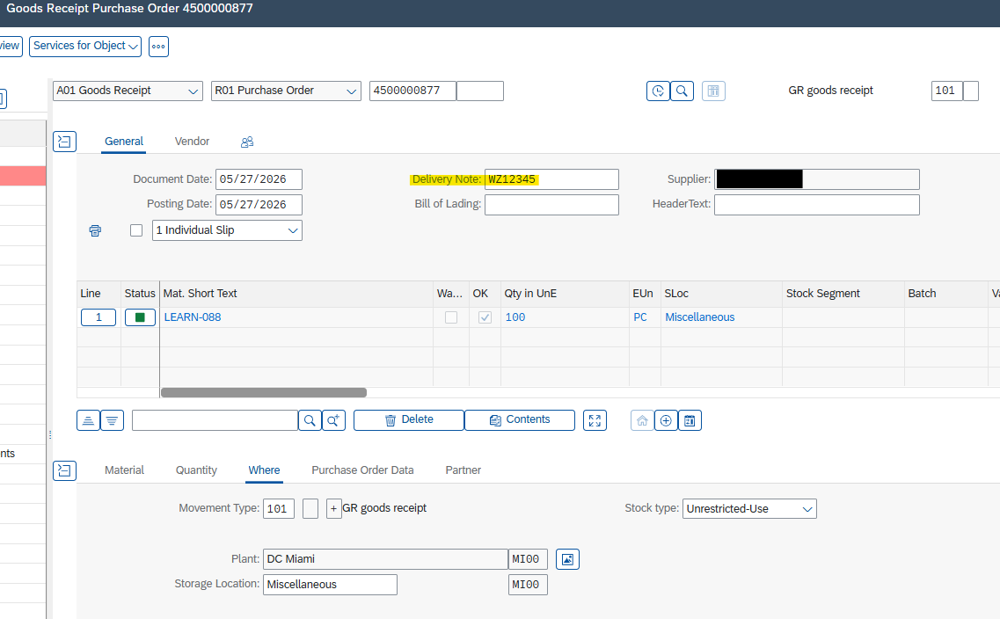
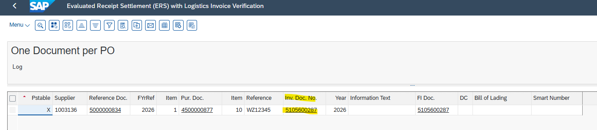
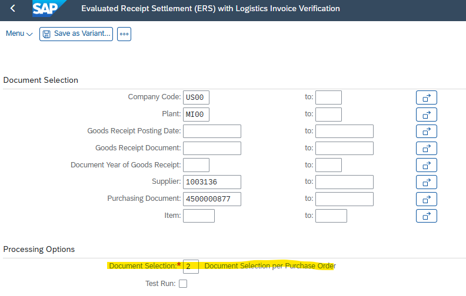
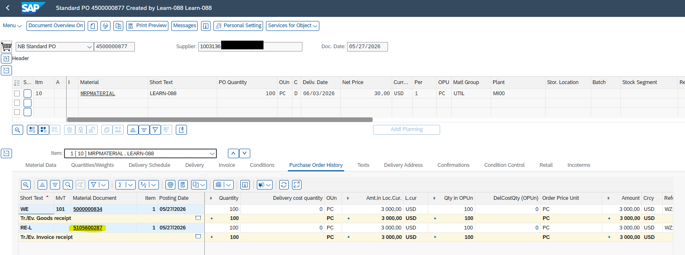

# Evaluated Receipt Settlement (ERS) Configuration and Execution

---

## 1. Process Overview
This document outlines the configuration and execution steps for Evaluated Receipt Settlement (ERS) in SAP S/4HANA. 

ERS automates invoice creation based on Goods Receipt (GR) data. Instead of expecting an invoice from the vendor, the system posts an internal invoice (credit memo) automatically. This process eliminates manual invoice verification, ensures quantity and price consistency, and prevents duplicate payments.

---

## 2. Master Data Prerequisites

Specific indicators must be maintained in the Business Partner (BP) and Purchasing Info Record (PIR) to enable ERS.

### 2.1 Business Partner Setup (Transaction: BP)

Configure the following roles for the vendor:

#### Purchasing Role (`FLVN01`) - Purchasing Data Tab
- `GR-Based Invoice Verif.` = **Checked** – Ensures invoices are matched to specific GR documents.
- `Eval. Receipt Settlement` = **Checked** – Enables ERS processing for this vendor.

#### FI Vendor Role (`FLVN00`) - Payment Transactions Tab
- `Terms of Payment` = Maintained (e.g., **0001**) – Required for due date calculation in FI documents.
- `Check Double Invoice` = **Checked** – Standard control parameter to prevent duplicate FI postings.

---

### 2.2 Purchasing Info Record (Transaction: ME11 / ME12)

Maintain the specific material-vendor relationship:

- `GR-Bsd IV` = **Checked** - `No ERS` = **Unchecked** (Empty) – Must remain blank; checking it excludes the material from ERS.
- `Tax Code` = Maintained (e.g., **XI / I0**) – Required for the system to calculate gross amounts and tax postings during automatic settlement.

---

## 3. Transactional Execution

### Step 1: Create Purchase Order (ME21N)
Create a standard PO. On the item level, navigate to the **Invoice** tab and verify that default values from Master Data are populated:
- `Inv. Receipt` = **Checked**
- `GR-Bsd IV` = **Checked**
- `ERS` = **Checked**
- `Tax Code` = Validated

### Step 2: Post Goods Receipt (MIGO)
Post the Goods Receipt (Movement Type `101`).
> ⚠️ **Important:** You must enter the vendor's delivery note number in the `Delivery Note` field on the Header General tab. The ERS program uses this value as the reference number (`XBLNR`) in the FI invoice document.

---

## 4. ERS Invoice Settlement (MRRL)

Run transaction **MRRL** to generate the invoice documents.

#### 4.1 Selection Parameters
1. Enter `Company Code` and `Plant`.
2. Check **Per Purchase Order Item** for line-item processing.
3. Keep **Test Run** checked for initial validation of tax and account assignments.

#### 4.2 Posting
If the test run shows no errors, uncheck **Test Run** and execute (`F8`). 
The system posts:
- Logistics Invoice Document (MM)
- Accounting Document (FI)

---

## 5. Verification (ME23N)

Review the Purchase Order History tab in ME23N. The system displays both the Goods Receipt (`WE`) and the automatically generated Invoice Receipt (`RE-L`). The quantities and values will match exactly, clearing the GR/IR account for the item.

