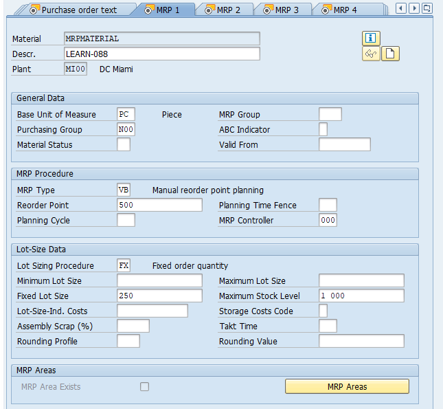
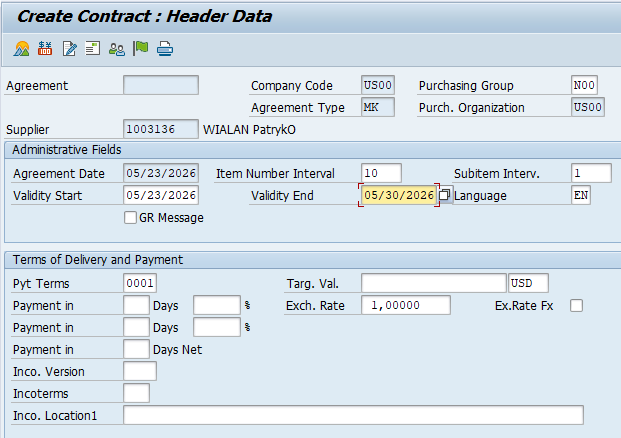
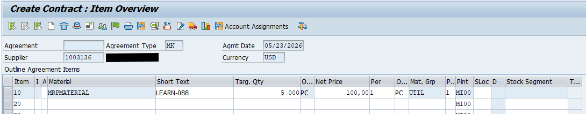
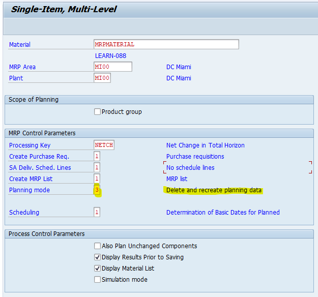
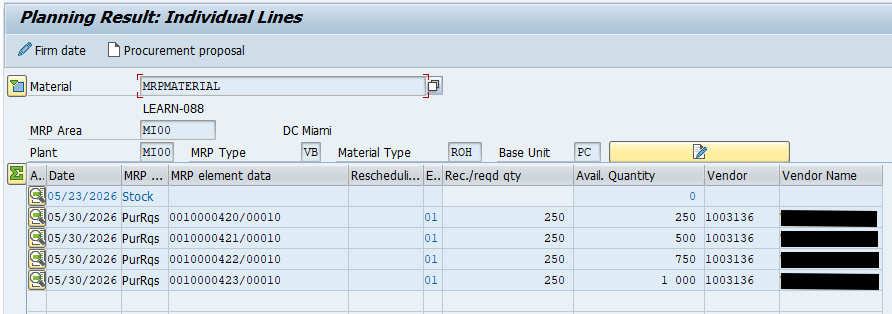
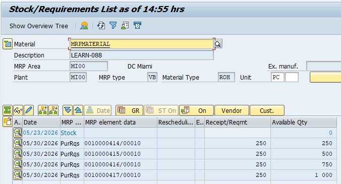

# MRP Run with Automatic Source Determination (PR → PO)

---

## 1. Business Purpose

This process describes Material Requirements Planning (MRP) using manual reorder point planning (`VB`), where the system generates Purchase Requisitions (PR) when stock falls below a defined threshold.

---

## 2. Prerequisites & Master Data

---

## 2.1 Material Master (MM01 / MM02)

### MRP 1 View

- `MRP Type` = VB (Manual Reorder Point Planning)
- `Reorder Point` = stock level triggering replenishment
- `Lot Size` = FX (Fixed Order Quantity)

> Reorder Point defines the trigger level, not the target stock level.

---

### MRP 2 View

- `Procurement Type` = F (External Procurement → PR creation)
- `Planned Delivery Time` = required for scheduling
- `GR Processing Time` = goods receipt lead time
- `Safety Stock` = optional buffer below reorder point

### Example

---

## 3. Source of Supply Determination (SAP Logic)

Source determination during PR creation depends on available master data and system configuration.

Possible sources:

- Quota Arrangement (MEQ1)
- Source List (ME01) *(if active / required in customizing)*
- Scheduling Agreements (ME31L)
- Contracts (ME31K - MK / WK)
- Purchasing Info Records (ME11)

### Example - Quantity Contract (ME31K)

---

## 3.1 Important Notes

- Source determination is **not guaranteed by MRP**
- PR can be created **with or without vendor assignment**
- Priority logic is **configuration-dependent**
- Quota arrangement has priority only when active and applicable

---

## 4. MRP Run per Material (MD02)

To execute the MRP run for a specific material and plant, use transaction **MD02** (Single-Item, Multi-Level). In this step, the system compares current stock against the Reorder Point (`VB`) and generates the necessary procurement proposals (Purchase Requisitions). 

Key control parameters for the run:
- `Processing key` = NETCH (Net Change for Total Horizon)
- `Create purchase req.` = 1 (Purchase requisitions)
- `Scheduling` = 1 (Determination of Basic Dates for Planned Orders)
- `Planning mode` = 1 (Adapt planning data). Use this default for the initial run. 
  > **Note:** In the screenshot below, mode **3** (Delete and recreate planning data) is selected to explicitly delete existing PRs and replace them with new ones.

After executing the run (Enter), the system displays the MRP results indicating the number of procurement proposals created.

### Verifying PR Output (MD04)

After the MRP execution, the results can be reviewed in the Stock/Requirements List.

---

## 5. PR → PO Conversion 

The automatic conversion of Purchase Requisitions (PR) to Purchase Orders (PO) is covered in detail in a separate section of this repository.

👉 **[Go to Auto PO from PR documentation](../auto-po-from-pr/)**

---