# MRP-Driven Scheduling Agreement Procurement

---

## 1. Business Purpose

This repository documents an MRP-driven Scheduling Agreement procurement scenario. It demonstrates how the Material Requirements Planning (MRP) engine can generate scheduling agreement schedule lines when a valid scheduling agreement and source determination setup are available, allowing the direct conversion of independent demand into firm delivery schedule lines instead of standard purchase requisitions.

---

## 2. Prerequisites & Master Data

### 2.1 Material Master (MM01 / MM02)

#### MRP 1 View
- `MRP Type` = PD (MRP - Demand-driven planning)
- `Lot Size` = EX (Lot-for-lot order quantity)

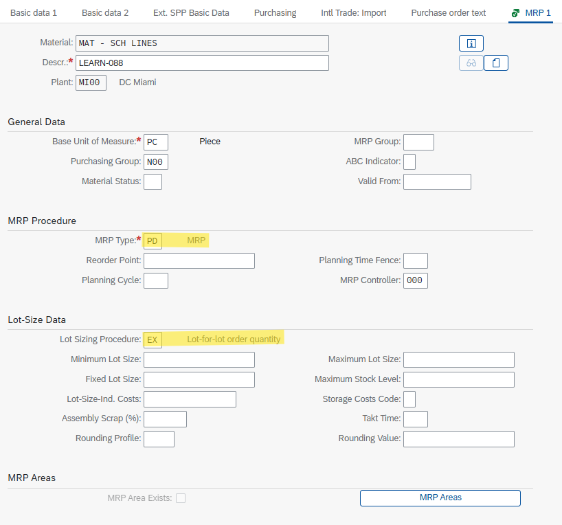

#### MRP 3 View
- `Strategy Group` = 40 (Planning with final assembly)

> **Note:** Strategy Group 40 is required to enable the creation of Planned Independent Requirements (PIRs) to simulate demand at the finished product or component level.

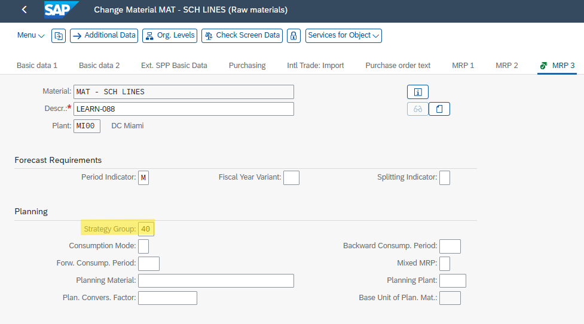

---

## 3. System Decision Logic

For MRP to bypass standard Purchase Requisition (PR) generation and directly create firm Schedule Lines, the system executes the following source determination logic during the planning run:

1. **Source List Evaluation:** The system checks ME01 for valid records corresponding to the requirement date.
2. **Scheduling Agreement Validity:** The referenced Scheduling Agreement (ME31L) must be active and valid for the calculated order date (requirement date minus planned delivery time).
3. **MRP Indicator Evaluation:** The `MRP` column in the Source List must be explicitly set to `2` (Record relevant to MRP and delivery schedules generated automatically).
4. **Fallback Mechanism (Time-Phasing):** If source determination fails (e.g., the Scheduling Agreement is not valid on the backward-scheduled order date), the system generates an exception message and outputs a standard Purchase Requisition as an alternative procurement proposal.

---

## 4. Source of Supply Configuration

### 4.1 Scheduling Agreement (ME31L)

A long-term agreement (`LP`) is established with the vendor.

- **Header Data:** Validity start and end dates define the active window for automated call-offs.
  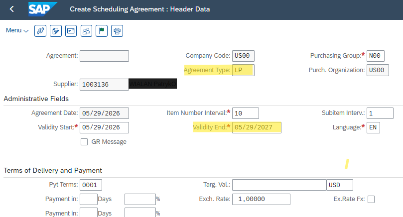
- **Item Overview:** Target quantity, Net Price, and receiving Plant/Storage Location.
  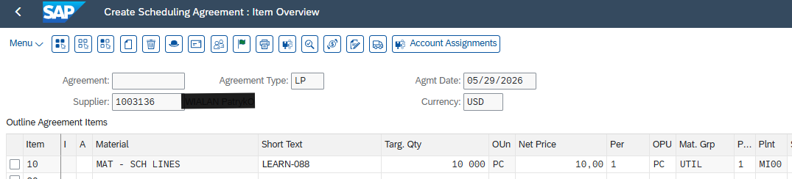
- **Item Details:** Standard Procure-to-Pay parameters are maintained (e.g., `IR`, `GR-Based IV`). 
  > *Optional automation:* The `ERS` (Evaluated Receipt Settlement) flag is checked here for automated AP invoice generation upon Goods Receipt, though it does not impact the MRP execution logic itself.
  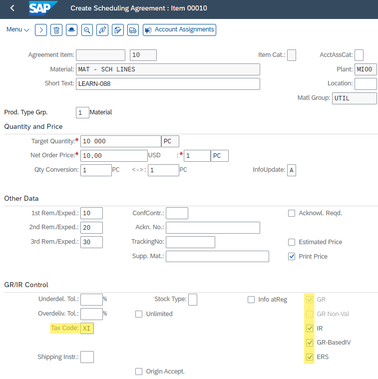

### 4.2 Source List (ME01)

The Scheduling Agreement is mapped to the Material/Plant combination.
- **Key Parameter:** The `MRP` indicator is set to **`2`**.

> **Configuration Note:** For standard external vendors, the supplying plant (`PPl`) field must remain blank to prevent conflicts with internal Stock Transport Order (STO) logic.

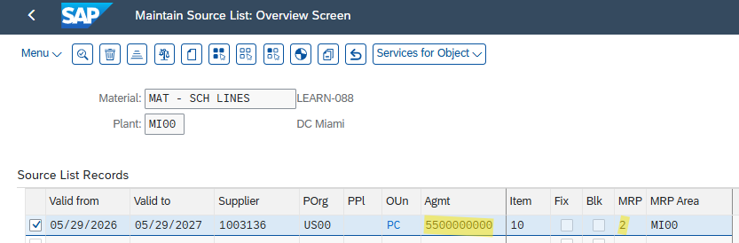

---

## 5. Demand Generation (MD61)

Planned Independent Requirements (PIRs) are maintained to trigger the MRP engine and simulate business demand.

- **Initial Screen:** Active Version `00`.
  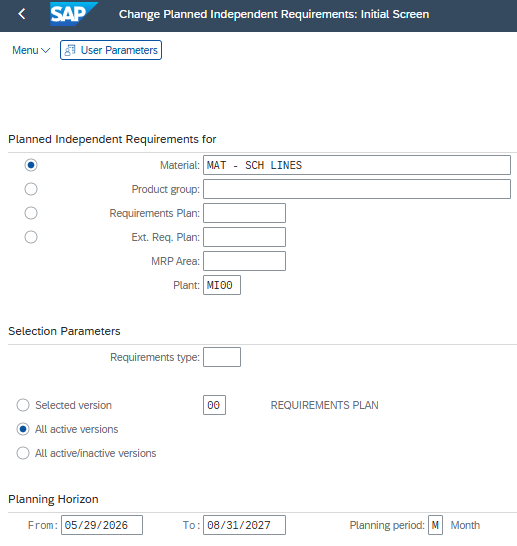
- **Schedule Lines:** Demand quantities (e.g., 500, 600 PC) are assigned to specific future planning periods.
  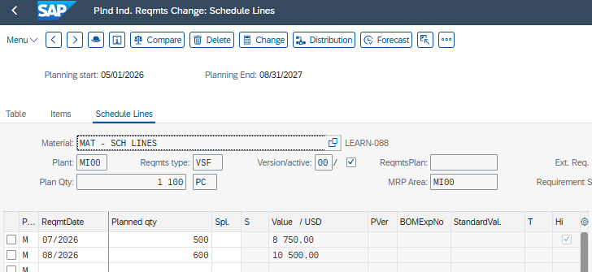

---

## 6. MRP Run & Execution (MD02)

Transaction **MD02** (Single-Item, Multi-Level) is executed to process the requirements.

Key control parameters:
- `Processing Key` = NETCH (Net Change for Total Horizon)
- **`SA Deliv. Sched. Lines` = 3 (Schedule lines)**

> **Parameter Significance:** Setting parameter `3` instructs the algorithm to evaluate existing Scheduling Agreements via the Source List and convert net requirements directly into Schedule Lines where source determination is successful.

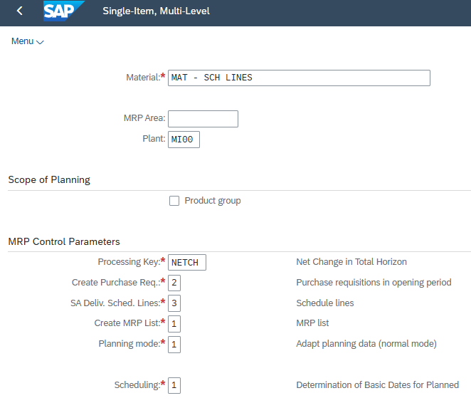

Post-execution database statistics confirm the successful creation of Schedule Lines.

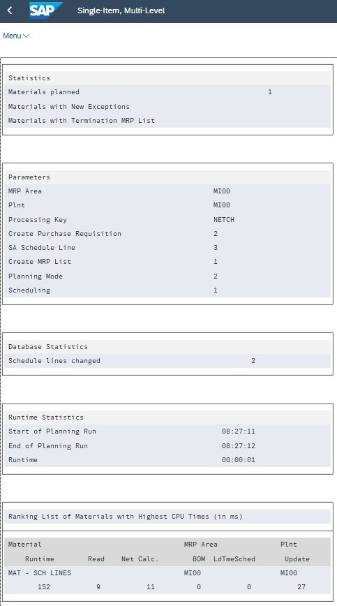

---

## 7. Verifying Results (MD04)

The Stock/Requirements List (MD04) validates the execution of the system logic:

- The system recognizes the entered demand (`IndReq`).
- MRP generates firm Delivery Schedule Lines (`SchLne`).
- The `SchLne` is directly linked to the specific Scheduling Agreement number (`5500000000`) and the assigned vendor.
- If any requirements fall outside the valid time-phased master data setup, standard `PurRqs` elements are visible alongside relevant exception messages (e.g., message `30`), requiring manual buyer intervention.

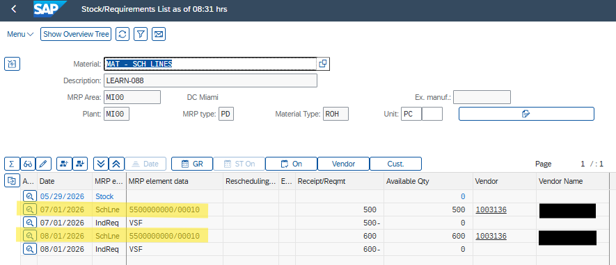