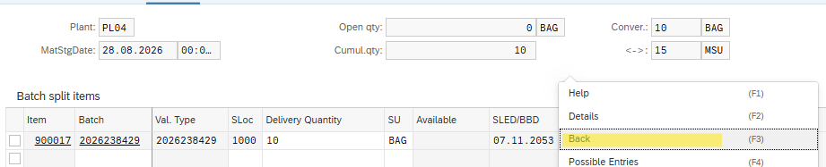
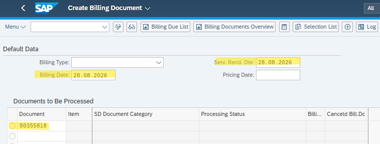
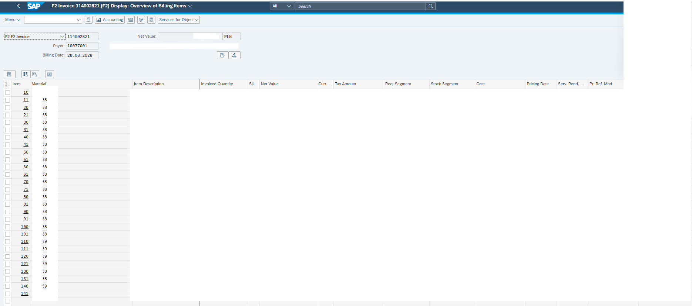
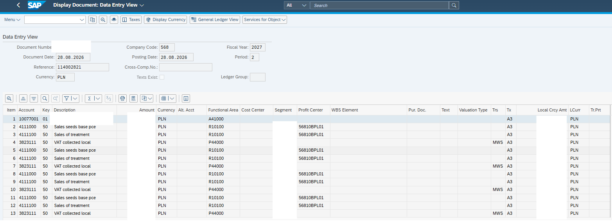

# Order-to-Cash (O2C) Procedure

---

## 1. Business Purpose

This repository documents a standard Order-to-Cash (O2C) scenario in SAP. It covers the end-to-end process starting from Sales Order creation, outbound delivery processing, batch management (determination and splitting), picking, post goods issue (PGI), and finally billing and financial accounting verification.

---

## 2. Sales Order Creation (VA01)

The process begins with the creation of a standard Sales Order to capture customer demand.

1. **Maintain Sales Organization:** Enter the relevant Sales Organization data on the initial screen.
   

2. **Order Details:** 
   * Enter the **Sold-to Party** and **Ship-to Party**.
   * Enter the **Material** and required **Quantity**.
   * *Note:* Parameters such as Delivery Time, Payment Terms, and Incoterms (along with the Incoterms location) should populate automatically from the customer master data.

   

---

## 3. Outbound Delivery Creation (VL01N)

Once the Sales Order is saved, an outbound delivery is generated to initiate the logistics execution process.

* Create the delivery with reference to the Sales Order.
  

---

## 4. Batch Determination & Splitting

Proper batch assignment is critical before proceeding to picking and goods issue.

1. **Initial Batch Check:** Navigate directly to the picking tab. Select the `+` (plus) icon to verify if the system performed the correct automatic batch determination.
   

2. **Manual Batch Splitting:** If the system makes an incorrect batch determination, select the main item row and click the **Batch Split** button.
   

3. **Removing Incorrect Batches:** In the new window, select all incorrectly assigned batches and remove them using the `-` (minus) icon.
   

4. **Assigning Correct Batches:** 
   * Input the correct batch and assign the expected quantity to it.
   * To fulfill the order, all quantity from the **Open Qty** field must be allocated. The **Open Qty** must display `0` after maintenance. 
   > **Troubleshooting Note:** If the open quantity is greater than zero, it means not all required quantity is assigned. Occasionally, SAP can block various batches even if they are in stock. This happens because other delivery items may have mistakenly reserved that batch. You can only pick the unassigned (free) quantity. Once you correct the conflicting lines, you can return to this position to assign the remaining expected quantity.

   

5. **Confirm and Return:** Press `Enter` and navigate back to the main screen.
   

---

## 5. Picking and Post Goods Issue

With batches correctly assigned, the physical warehouse operations are recorded.

1. **Picking Execution:** 
   * After returning, input the quantity from `Deliv. Qty` into the `Picked Qty` field.
   * If executed correctly and all quantity for the line item is picked, the overall picking status field (`OvrPickStatus`) changes from **A** (Not yet picked) to **C** (Fully picked). 
   * Return to the main screen by clicking the `-` (minus) icon.
   

2. **Post Goods Issue (PGI):** 
   * Once picking for the entire order is complete, the header picking status changes from **B** (Partially picked) to **C** (Fully picked).
   * Click **Post Goods Issue** to withdraw the stock from the warehouse and record the material movement.
   

---

## 6. Billing and Invoicing (VF01)

Following goods issue, a billing document is generated to charge the customer.

1. **Invoice Creation:** 
   * Copy the outbound delivery number—this is required for invoice creation in transaction **VF01**.
   * Maintain the **Billing Date** (Data wystawienia) and **Services Rendered Date** (Data sprzedaży). 
   > **Note:** The Services Rendered Date directly impacts tax determination.
   

2. **Document Output:** 
   * After saving the billing document, navigate to `Menu > Display Bill Document > Continue > Header > Output Preview`. This generates the PDF invoice for the customer.
   

---

## 7. Financial Accounting Validation

The final step is to verify the financial impact of the billing document.

* Click the **Accounting** button from the billing document display and select the first row to view the generated financial postings (e.g., Accounts Receivable, Revenue, Tax).
  
  
  