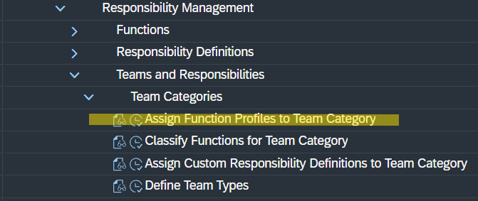
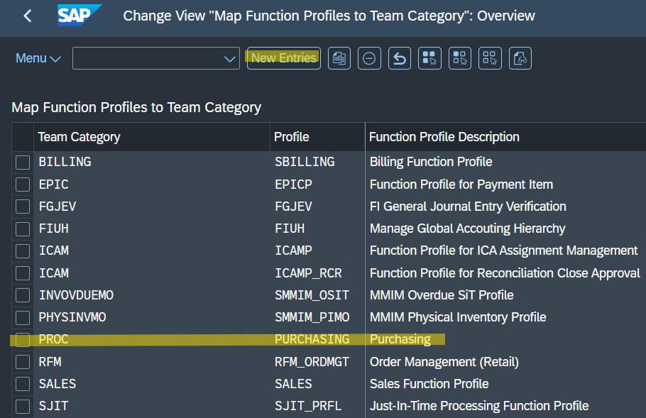
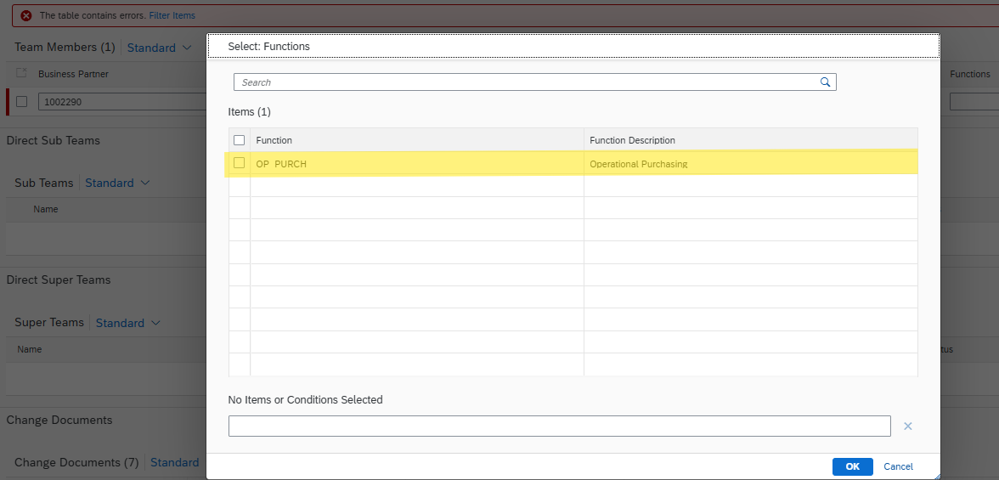

# Responsibility Management: Function Profiles Customizing

---

## 1. Business Purpose

This repository documents the required backend configuration to enable function selection within the SAP Fiori app **Manage Teams and Responsibilities - Procurement**. To process and assign team members successfully, specific Functions must be mapped to the corresponding Team Category.

---

## 2. Configuration Path (SPRO)

To map the function profiles, navigate through the following path in the SAP Customizing Implementation Guide (SPRO):

* **Cross-Application Components**
  * **General Application Functions**
    * **Responsibility Management**
      * **Teams and Responsibilities**
        * **Team Categories**
          * **Assign Function Profiles to Team Category**

---

## 3. Mapping Function Profiles

Based on the specific **Type** selected in the "Manage Teams and Responsibilities - Procurement" app, you must configure a new entry with the correct **Team Category**.

1. **Add New Entry:** Navigate to the mapping table and add a new row.
2. **Matching Categories:** The Team Category configured here must perfectly match the Type used in the Fiori app. 
   * *Example:* If you select the type `PROC` in the Fiori application, the Team Category in this configuration table must also be defined as `PROC`.
3. **Assign Profile:** Link it to the relevant function profile (e.g., `PURCHASING`) so the correct roles are loaded.

---

## 4. Fiori App Validation

Once the SPRO configuration is saved, the changes will immediately reflect in the frontend application.

* Return to the **Manage Teams and Responsibilities - Procurement** Fiori app.
* Refresh the browser window or reload the team creation screen.
* Navigate to the **Functions** column for your team member. The mapped functions are now fully visible and available for selection in the drop-down menu.

