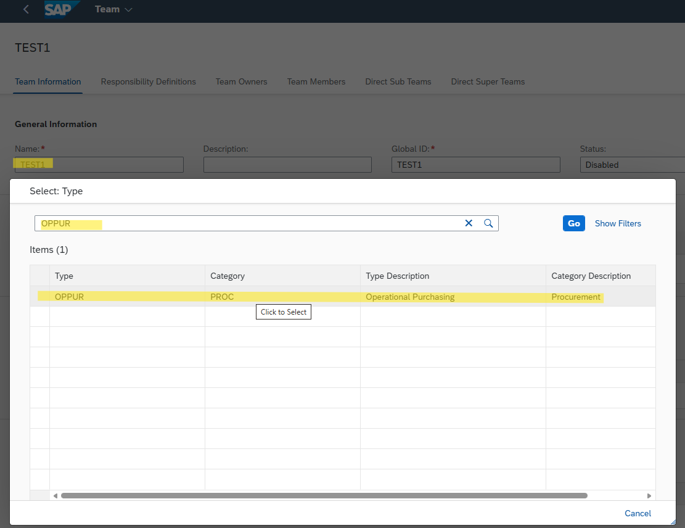
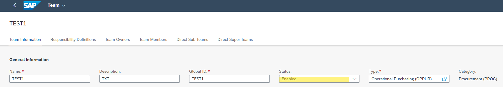
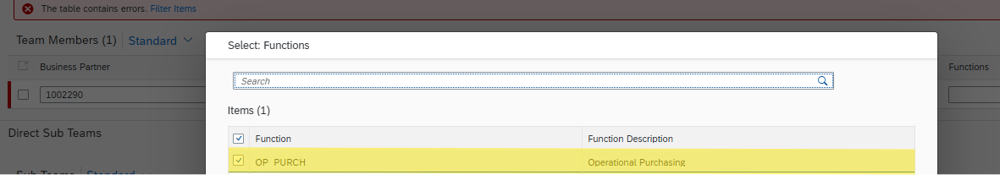
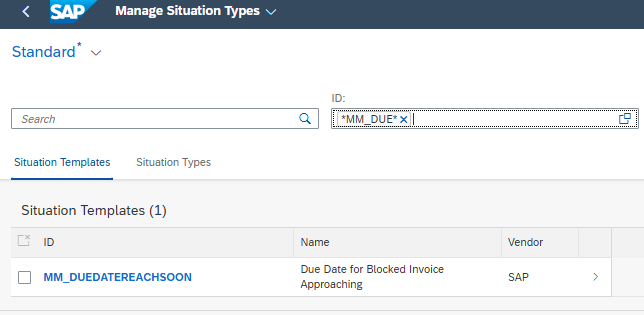
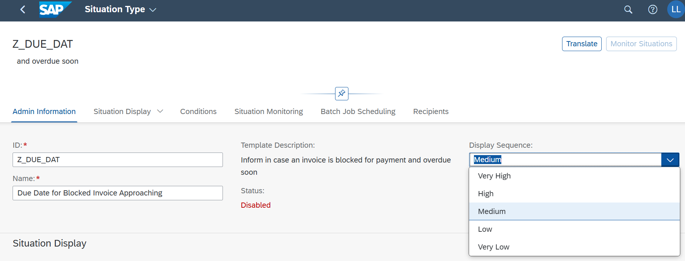
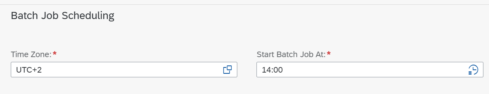
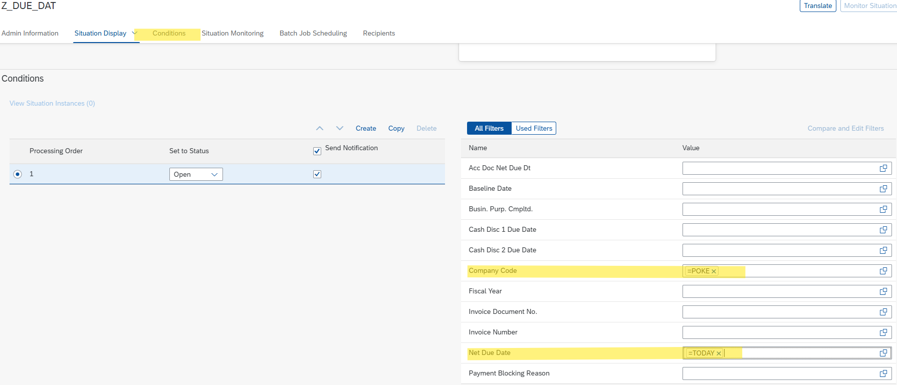
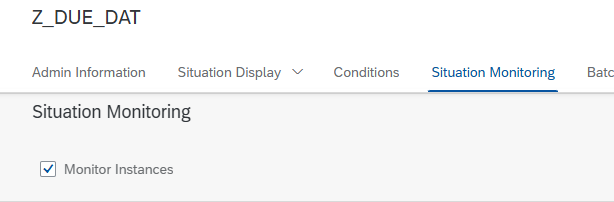

# Situation Handling: End-to-End Procedure

---

## 1. Prerequisites

Before starting the procedure, ensure you have the correct roles and authorizations assigned. If you do not have access to the **Manage Teams and Responsibilities - Procurement** application in SAP Fiori, please refer to the [Rule Customizing](../Rule%20Customizing/README.md) documentation to assign the required PFCG roles.

---

## 2. Managing Teams and Responsibilities

The first phase involves setting up the team responsible for handling the specific procurement situation.

### 2.1 Team Creation
1. Open the **Manage Teams and Responsibilities - Procurement** app in SAP Fiori.
2. Click **Create**.
3. Enter a **Name** for the team.
4. Select the **Type** as `OPPUR` (Operational Purchasing).

### 2.2 Enabling the Team
* Ensure the **Status** of the team is changed to **Enabled** so it becomes active in the system.

### 2.3 Responsibility Definitions
* Define the operational scope of the team by assigning specific filters under **Responsibility Definitions**.
* Set filters for your specific **Company Code** and **Purchasing Organization**.

### 2.4 Assigning Team Members
* Add the required Business Partners under the **Team Members** section.
* Assign the appropriate **Function** to each member.
> **Note:** If the Functions drop-down list is empty, the function profiles are not mapped correctly to the `OPPUR` category. Refer to the [Function Profiles Customizing](../Function%20Profiles%20Customizing/README.md) documentation to fix the backend configuration.

---

## 3. Configuring the Situation Type

Once the team is established, you need to configure the actual situation scenario that will trigger notifications.

### 3.1 Copying the Standard Template
1. Open the **Manage Situation Types** app in SAP Fiori.
2. Search for the standard SAP template ID: `MM_DUEDATEREACHSOON`.
3. Select the template and click **Copy**.

### 3.2 Defining Custom ID and Display Sequence
1. Assign a new custom **ID** for your copied situation type. 
   * *Requirement:* Custom IDs must start with the letter **Z** or **Y** (e.g., `Z_MM_DUEDATE`).
2. Configure the **Display Sequence** to prioritize how notifications appear.

### 3.3 Batch Job Scheduling
* Under the Batch Job scheduling section, select the appropriate **Time Zone** and configure the job parameters to automatically scan for due dates.

### 3.4 Setting Conditions
* Navigate to the **Conditions** section.
* Define the specific criteria that will trigger the situation. Input your **Company Code** and define the **Net Due Date** parameters (e.g., number of days before a delivery is due).

### 3.5 Activating Monitoring
* Go to the **Situation Monitoring** tab.
* Check the box to activate **Monitor Instances**. This enables you to track how many times this situation is triggered by the system.
* Finally, click **Create** or **Save** to activate your custom situation type.

