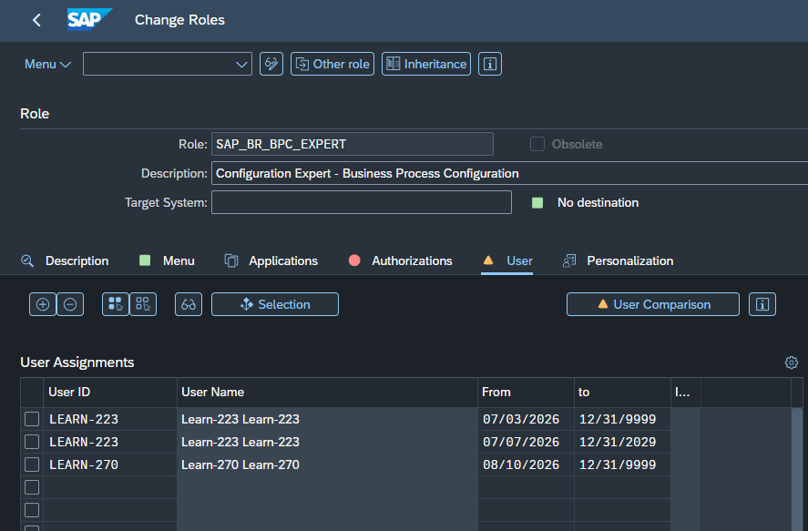
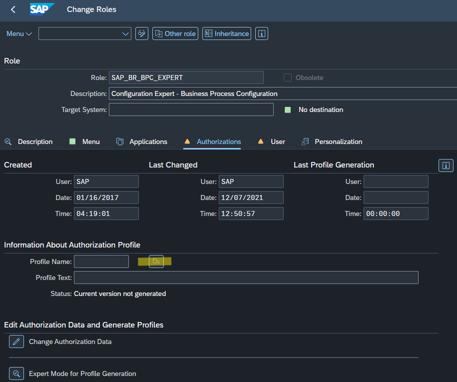
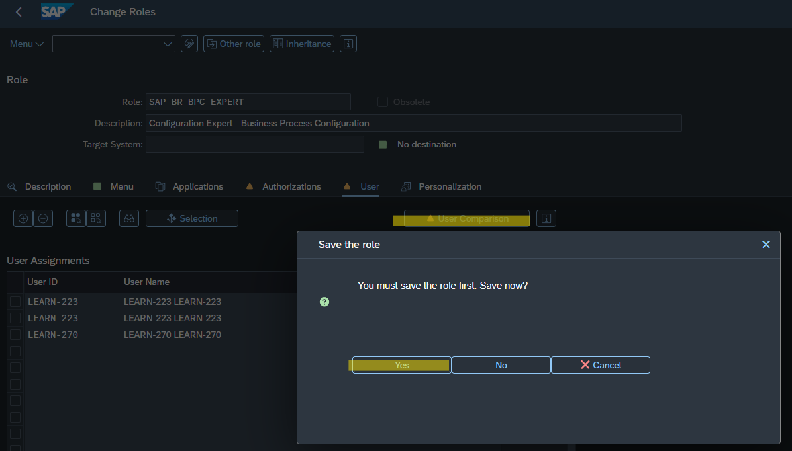
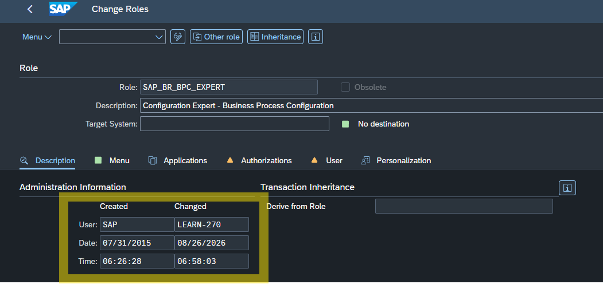

# SAP S/4HANA Situation Handling - Customization & Role Assignment

Situation Handling is a framework within SAP S/4HANA that increases the quality and efficiency of your business processes by automatically detecting exceptional situations and notifying specific user groups based on defined teams and responsibilities[cite: 4]. 

To define object-based situation types in the SAP Fiori launchpad using the **Manage Situation Types** app, you need to be assigned the Configuration Expert - Business Process Configuration business role (`SAP_BR_BPC_EXPERT`)[cite: 1, 4]. Below is a step-by-step guide on how to assign this role and generate the necessary authorization profile.

## Authorization Configuration (PFCG)

This step is crucial to gain access to the administration app in SAP Fiori.

1. In the classic SAP GUI, open the **PFCG** transaction (Role Maintenance) and find the `SAP_BR_BPC_EXPERT` role[cite: 1]. 
2. Navigate to the **User** tab and enter your system login at the bottom of the screen[cite: 1]. Ensure your ID is listed in the user assignments.

   

3. Go to the **Authorizations** tab, click the pencil icon (Change Authorization Data), and click the **Generate** button to create the authorization profile[cite: 1]. 

   

4. Return to the **User** tab, click the **User Comparison** button, and select the **Full comparison** option[cite: 1]. 

   

5. The operation is successful when a green indicator appears next to your login[cite: 1]. You can also check the Description tab to see the last changed date updated with your user name.

   

After completing these steps, remember to save your changes[cite: 1]. You will now be able to access the **Manage Situation Types** app in the SAP Fiori launchpad and proceed with configuring the business logic for your situations[cite: 1, 4].