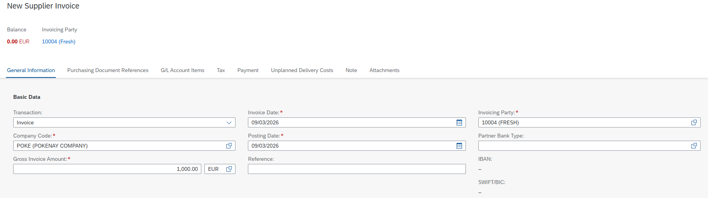
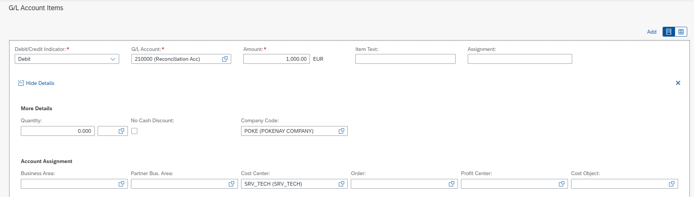
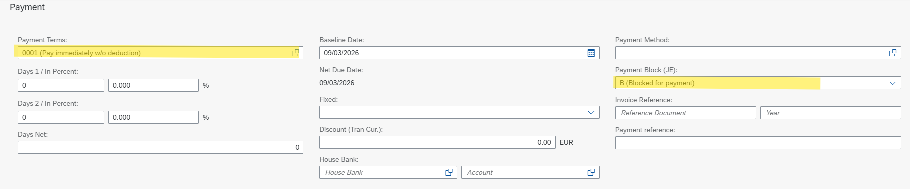
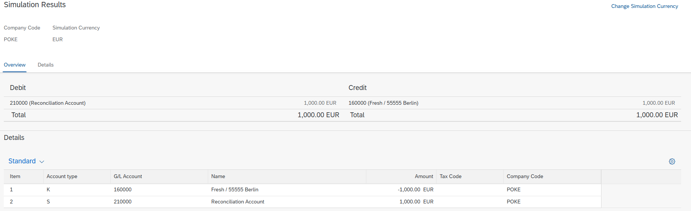
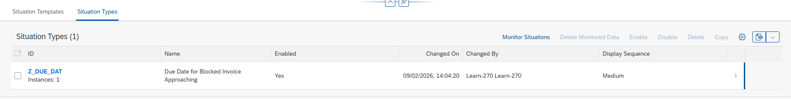
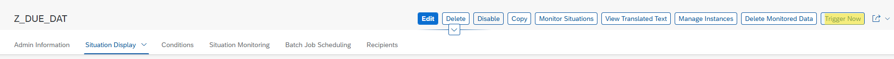
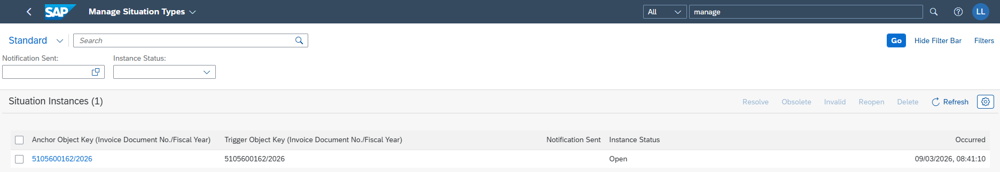

# Situation Handling: Execution and Testing

---

## 1. Test Objective

To successfully trigger the Situation Handling notification based on the previous configuration, we must create a specific business scenario: a **blocked supplier invoice with an overdue payment**. 

This can be performed via the SAP GUI using transaction **MIRO** (which requires a Purchase Order reference) or directly through the SAP Fiori app **Create Supplier Invoice** (which allows financial posting without a logistics reference). This guide uses the Fiori app method.

---

## 2. Invoice Creation (Fiori)

1. **Header Details:** Enter the required dates (Invoice and Posting dates), the total gross amount, and select the appropriate Invoicing Party.
   

2. **G/L Account Assignment:** Scroll down to the item level. Enter the Debit G/L Account, the corresponding line amount, and the appropriate Cost Center.
   

3. **Payment Parameters:** Navigate to the payment section. Enter payment term `0001` (Pay immediately w/o deduction) to ensure the net due date is reached immediately, and explicitly set a **Payment Block**.
   

4. **Simulate and Post:** Click **Simulate** to verify the financial postings (taxes, vendor credits, G/L debits), then click **Post** to generate the accounting document.
   

---

## 3. Triggering and Validation

With the blocked invoice created, the system must now evaluate the conditions to generate the alert.

1. **Access Situation Types:** Open the **Manage Situation Types** app and navigate to the **Situation Types** tab. Select the custom situation you configured in the previous procedure.
   

2. **Manual Trigger:** Click **Trigger Now** to force the background batch job to execute immediately, rather than waiting for its next scheduled time interval.
   

3. **Expected Result:** A Fiori launchpad notification will instantly appear for all authorized users assigned to the procurement team, warning them of the overdue and blocked invoice.
   