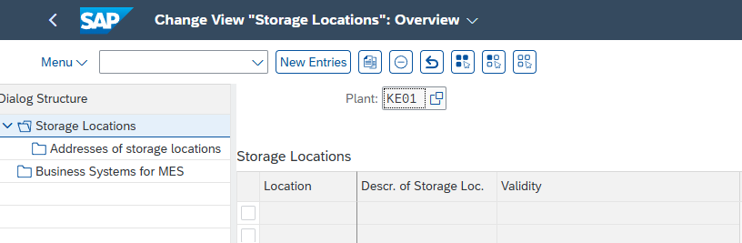

# Enterprise Structure: Purchasing Structure Baseline Setup

---

## 1. Business Purpose

This repository documents the foundational configuration of the organizational purchasing structure at SAP. Establishing this framework is a mandatory prerequisite for activating the Materials Management (MM) module. A fully linked purchasing structure ensures that procurement processes, inventory management, and material valuation can be executed and recorded accurately across the enterprise.

---

## 2. Process Flow (T-Codes)

The configuration follows a sequential path through the SAP enterprise structure framework to create and assign the necessary organizational units:

**`OX10`** (Plant) ➔ **`OX09`** (Storage Location) ➔ **`OX08`** (Purchasing Organization) ➔ **`OME4`** (Purchasing Group) ➔ **`OX18`** (Assign Plant to CoCd) ➔ **`OX17`** (Assign Purch. Org. to Plant) ➔ **`OX01`** (Assign Purch. Org. to CoCd)

---

## 3. Organizational Structure Configuration

### 3.1 Plant Creation (OX10)

The Plant is the central organizational unit in production planning and materials management. 

- **Creation Path:** `SPRO -> Enterprise structure -> Definition -> General logistic -> Definition, copy, deletion, checking plant`.
- **Process:** The plant is established and local address details are assigned.
  
  
  

### 3.2 Storage Location (OX09)

Storage locations are defined within a plant to differentiate between various material stocks (e.g., raw materials, finished goods).

- **Creation Path:** `SPRO -> Enterprise structure -> Definition -> Material management -> Storage location`.
- **Process:** Specifying the name of the storage location and its description, followed by capturing the changes in a transport request.
  
  
  
  

### 3.3 Purchasing Organization (OX08)

The Purchasing Organization is responsible for procuring materials and negotiating conditions with vendors.

- **Creation Path:** `SPRO -> Enterprise structure -> Definition -> Material Management -> Purchasing organization`.
- **Process:** Creating the unit by specifying the purchasing organization number and description.
  
  
  

### 3.4 Purchasing Group (OME4)

The Purchasing Group represents the buyer or group of buyers responsible for day-to-day purchasing activities.

- **Creation Path:** `SPRO -> Material management -> Purchasing -> Create Purchasing Group`.
- **Process:** Specifying the name of the purchasing group and its operational details.
  
  

---

## 4. Architecture Verification & Assignments

After defining the isolated structural units, they must be linked to establish the system's operational architecture.

### 4.1 Assignment: Plant to Company Code (OX18)

Linking the logistical entity (Plant) to the financial entity (Company Code) ensures that material movements trigger correct financial postings.

- **Assignment Path:** `SPRO -> Enterprise structure -> Assignment -> General logistic -> Assignment plant – company code`.
- **Process:** Specifying the company code and plant to bind them.
  
  
  

### 4.2 Assignment: Purchasing Organization to Plant (OX17)

Enables the Purchasing Organization to procure materials specifically for the assigned Plant.

- **Assignment Path:** `SPRO -> Enterprise structure -> Assignment -> Material Management -> Assign Purchasing Organization to Plant`.
- **Process:** Specifying the Purchasing organization number and corresponding plant.
  
  
  

### 4.3 Assignment: Purchasing Organization to Company Code (OX01)

Connects procurement operations directly to the financial ledgers of the Company Code.

- **Assignment Path:** `SPRO -> Enterprise structure -> Assignment -> Material management -> Assign purchasing organization to company code`.
- **Process:** Specifying the company code for the newly created purchasing organisation.
  
  