# Enterprise Structure: Purchasing Structure Baseline Setup

---

## 1. Business Purpose

This repository documents the foundational configuration of the organizational purchasing structure at SAP. Establishing this framework is a mandatory prerequisite for activating the Materials Management (MM) module. A fully linked purchasing structure ensures that procurement processes, inventory management, and material valuation can be executed and recorded accurately across the enterprise.

---

## 2. Process Flow (T-Codes)

The configuration follows a sequential path through the SAP enterprise structure framework to create and assign the necessary organizational units:

**`OX10`** (Plant) ➔ **`OX09`** (Storage Location) ➔ **`OX08`** (Purchasing Organization) ➔ **`OME4`** (Purchasing Group) ➔ **`OX18`** (Assign Plant to CoCd) ➔ **`OX17`** (Assign Purch. Org. to Plant) ➔ **`OX01`** (Assign Purch. Org. to CoCd)

---

## 3. Organizational Structure Configuration

### 3.1 Plant Creation (OX10)

**Purpose:** The Plant is defined to represent a physical or operational logistical location where material stocks are managed, valued, and utilized in enterprise operations.

- **Creation Path:** `SPRO -> Enterprise structure -> Definition -> General logistic -> Definition, copy, deletion, checking plant`.
- **Checklist Steps:**
  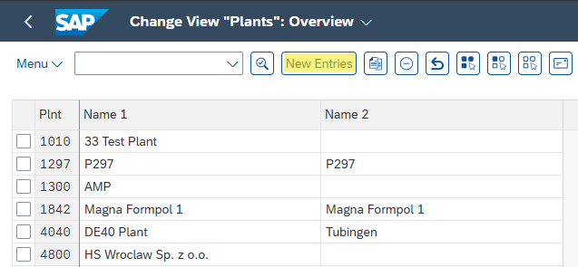
  *Step 1: Selecting the reference template to maintain localized organizational entries.*

  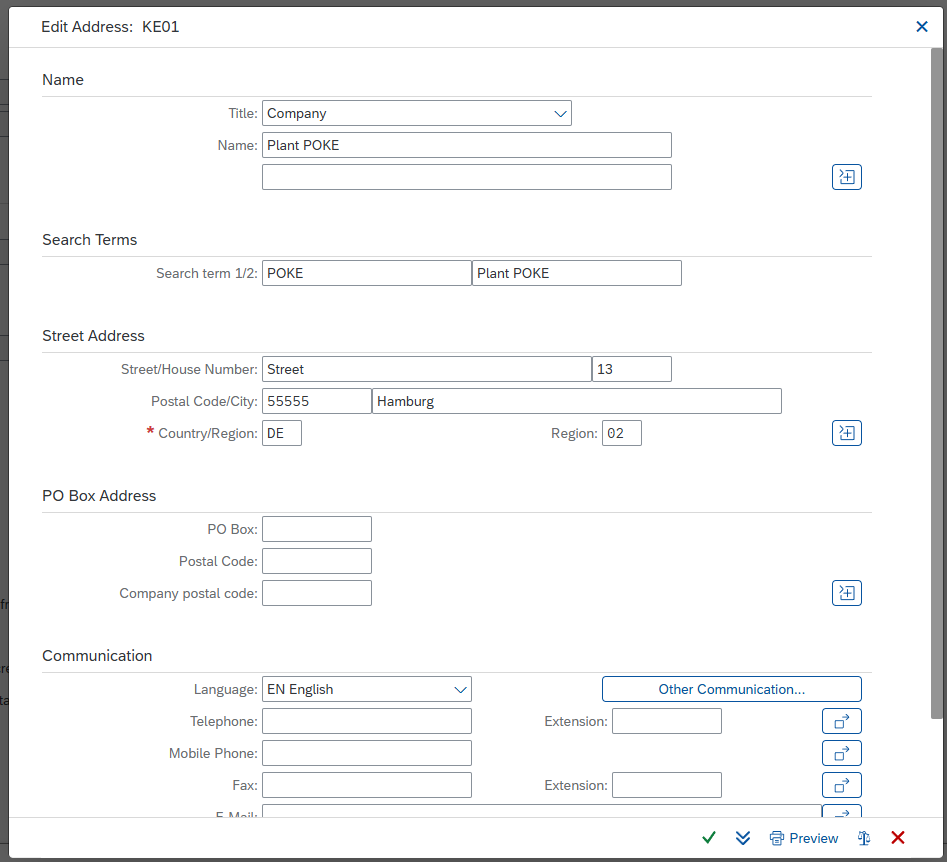
  *Step 2: Defining strict corporate address details and regional settings for the new unit.*

  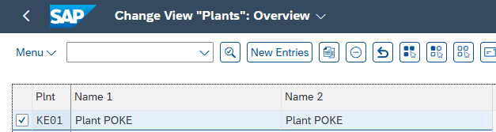
  *Step 3: Validating the active integration of the created Plant within the overview table.*

### 3.2 Storage Location (OX09)

**Purpose:** Storage Locations are maintained within the Plant to enable precise inventory tracking, stock segregation, and material movement control.

- **Creation Path:** `SPRO -> Enterprise structure -> Definition -> Material management -> Storage location`.
- **Checklist Steps:**
  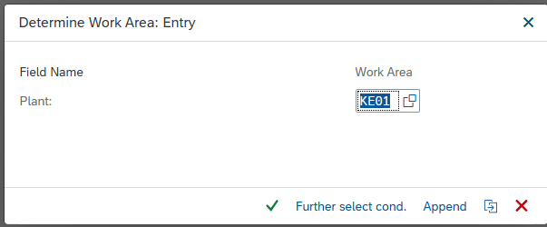
  *Step 1: Entering the specific target Plant to access its isolated storage infrastructure layout.*

  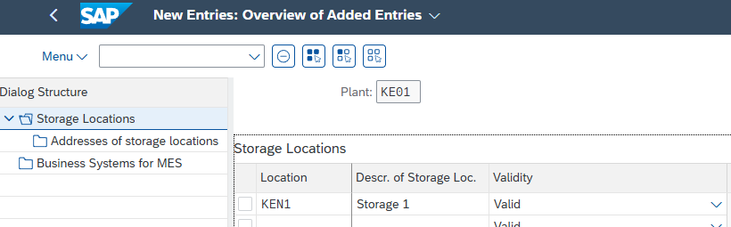
  *Step 2: Assigning the unique alphanumeric storage location key and its functional description.*

  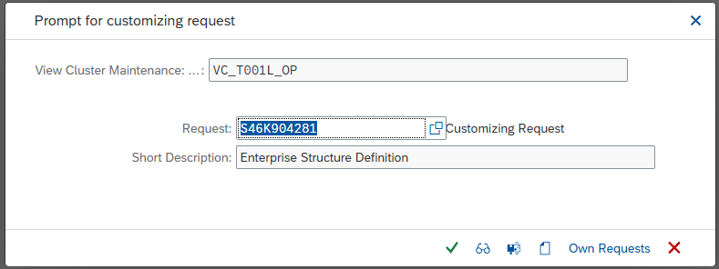
  *Step 3: Committing the data change to a Customizing Transport Request for database tracking.*

### 3.3 Purchasing Organization (OX08)

**Purpose:** The Purchasing Organization is established to act as the legal and operational entity responsible for vendor negotiations, contract definition, and daily procurement controls.

- **Creation Path:** `SPRO -> Enterprise structure -> Definition -> Material Management -> Purchasing organization`.
- **Checklist Steps:**
  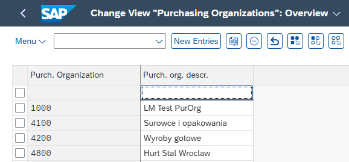
  *Step 1: Instantiating a new data record for the operational procurement unit.*

  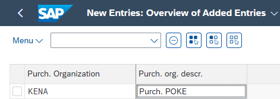
  *Step 2: Binding the specific Purchasing Organization code with its corporate descriptive name.*

  
  *Step 3: Securing the created organizational definition within the active Transport Request.*

### 3.4 Purchasing Group (OME4)

**Purpose:** Purchasing Groups are defined to assign day-to-day operational purchasing responsibilities to specific buyers or internal procurement teams.

- **Creation Path:** `SPRO -> Material management -> Purchasing -> Create Purchasing Group`.
- **Checklist Steps:**
  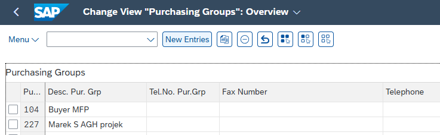
  *Step 1: Opening the configuration ledger to maintain individual buyer group records.*

  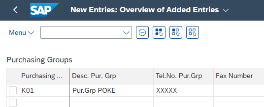
  *Step 2: Registering the unique group identifier along with corporate contact information.*

---

## 4. Architecture Verification & Assignments

### 4.1 Assignment: Plant to Company Code (OX18)

**Purpose:** This link is critical to connect logistical material movements directly with Financial Accounting (FI) ledgers for automated balance sheet updates.

- **Assignment Path:** `SPRO -> Enterprise structure -> Assignment -> General logistic -> Assignment plant – company code`.
- **Checklist Steps:**
  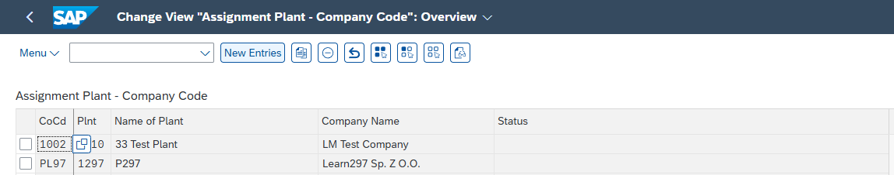
  *Step 1: Reviewing existing entity mapping before maintaining new organizational linkages.*

  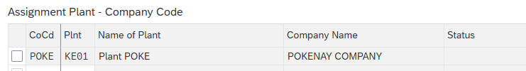
  *Step 2: Explicitly mapping the logistical Plant code to its primary financial Company Code.*

  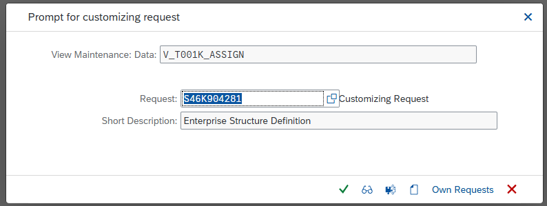
  *Step 3: Recording the structural assignment to the database via the Customizing TR.*

### 4.2 Assignment: Purchasing Organization to Plant (OX17)

**Purpose:** This assignment authorizes the corporate Purchasing Organization to buy goods, manage contracts, and handle operational procurement specifically for the designated Plant.

- **Assignment Path:** `SPRO -> Enterprise structure -> Assignment -> Material Management -> Assign Purchasing Organization to Plant`.
- **Checklist Steps:**
  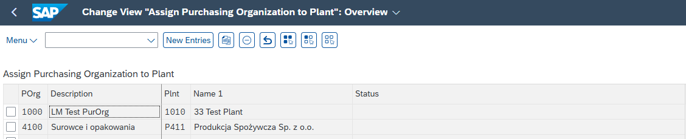
  *Step 1: Initializing a new cross-functional assignment between procurement and logistics.*

  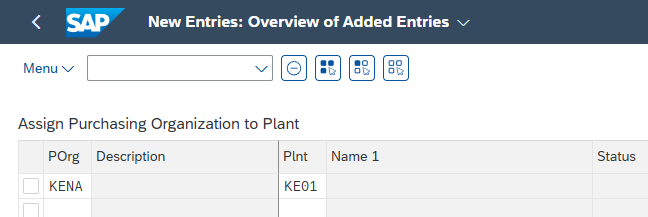
  *Step 2: Assigning the operational purchasing unit to manage procurement parameters for the target Plant.*

  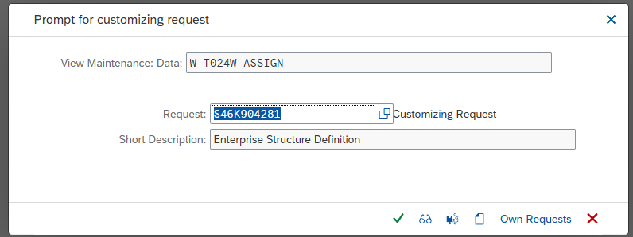
  *Step 3: Saving the organizational connection within the active transport container.*

### 4.3 Assignment: Purchasing Organization to Company Code (OX01)

**Purpose:** Linking the Purchasing Organization to the Company Code establishes financial accountability and sets the baseline for centralized or company-specific procurement.

- **Assignment Path:** `SPRO -> Enterprise structure -> Assignment -> Material management -> Assign purchasing organization to company code`.
- **Checklist Steps:**
  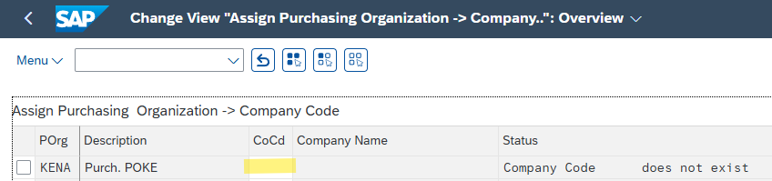
  *Step 1: Assigning the legal and financial accountability of the Purchasing Organization to the Company Code.*

  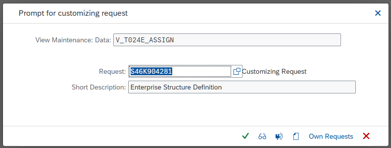
  *Step 2: Closing the purchasing structure deployment by verifying and saving the final TR record.*